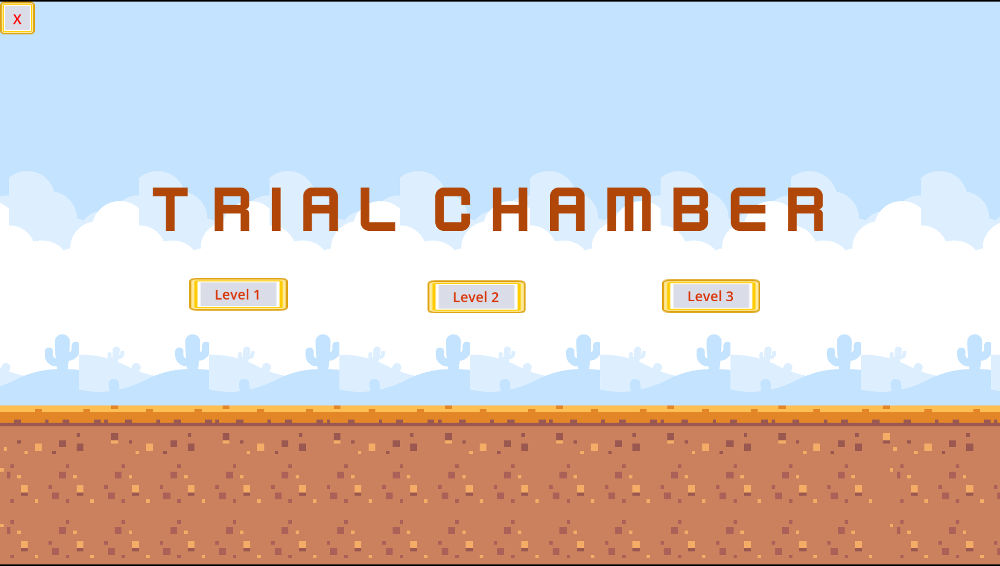
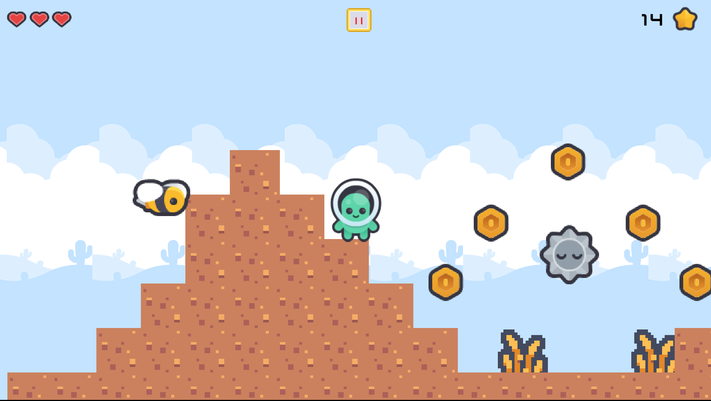
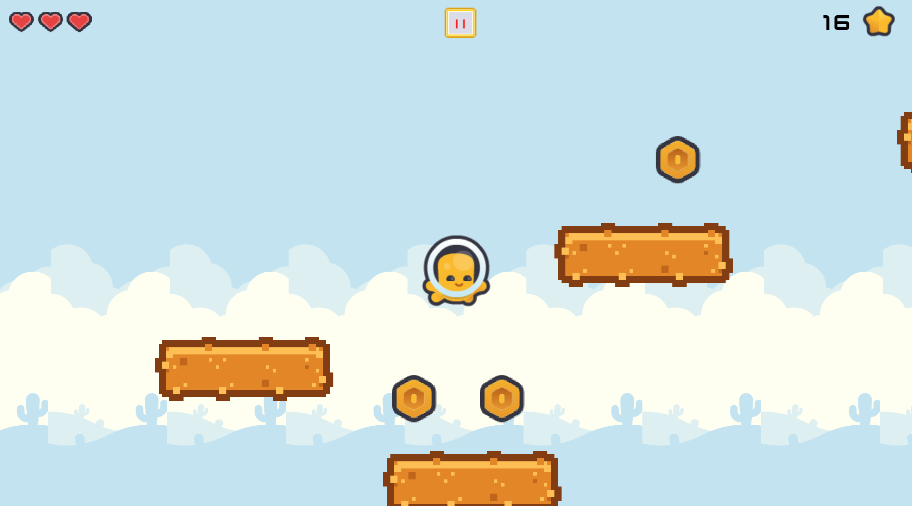
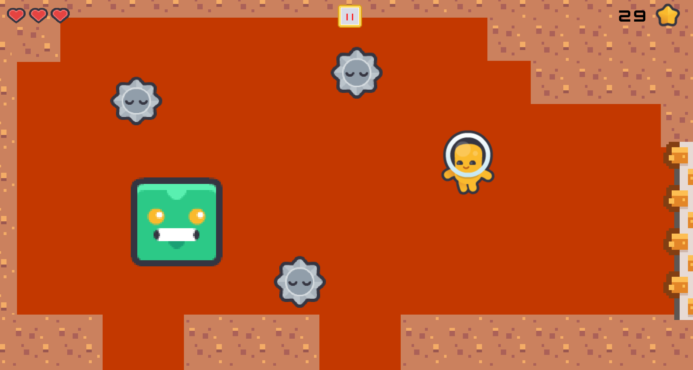

# 🎮 Trial Chamber

Trial Chamber is my first 2D platformer game developed using the **Godot Engine** and **GDScript**. This project was created to learn the fundamentals of 2D game development, including player movement, physics, collisions, enemy behaviors, animations, reusable components, and scene management.

---

## 📖 About the Game

Fight your way through challenging chambers filled with enemies, obstacles, and hazards. Progress through multiple levels, overcome increasingly difficult challenges, and defeat the final boss to complete the Trial Chamber.

---

# 📸 Screenshots

## 🏠 Home Menu

<p align="center">
  
</p>

The starting point of the adventure where players can begin their journey.

---

## 🎮 Level 1

<p align="center">
  
</p>

Learn the core mechanics while avoiding hazards and defeating enemies.

---

## 🎮 Level 2

<p align="center">
  
</p>

Face stronger enemies and more challenging platforming sections as the difficulty increases.

---

## 👹 Level 3 — Boss Battle

<p align="center">
  
</p>

Enter the final chamber and battle the boss. Dodge attacks, survive the encounter, and complete the Trial Chamber.

---

## ✨ Features

- 2D Platformer Gameplay
- Smooth Player Movement
- Physics-Based Jump Mechanics
- Custom Enemy Behaviors (Bee, Slime & Boss)
- Collision Detection System
- Animated Characters
- Health System
- Enemy Detection System
- Multiple Levels
- Boss Battle
- Scene Transitions
- Background Music & Sound Effects
- Win & Game Over Screens

---

## 🛠️ Built With

- **Engine:** Godot 4
- **Language:** GDScript
- **Platform:** Windows Desktop

---

## 📂 Project Structure

```text
assets/       - Sprites, textures, audio and game resources
images/       - README screenshots
scenes/       - Game scenes and levels
scripts/      - GDScript source files
project.godot - Godot project configuration
README.md     - Project documentation
```

---

## 🧩 Components Developed

During this project, I designed reusable game components, each with its own dedicated GDScript to manage specific behaviors.

### Gameplay Components

- Player Controller
- Bee Enemy Component
- Slime Enemy Component
- Boss Enemy Component

### Game Systems

- Health System
- Collision Detection System
- Enemy Detection System
- Camera System
- Collectible System
- Scene Transition System
- UI Components

Using separate scripts for each component helped keep the project modular, organized, and easier to maintain while allowing every game object to have its own independent behavior.

---

## 🧠 Concepts Learned

Throughout this project, I learned and implemented:

- Godot Nodes
- Scenes & Scene Instancing
- CharacterBody2D
- Area2D
- CollisionShape2D
- AnimatedSprite2D
- AnimationPlayer
- TileMaps
- Signals
- Timers
- Camera2D
- Physics & Gravity
- Input Handling
- Collision Layers & Masks
- State-Based Logic
- Component-Based Game Design
- Enemy Behaviors
- UI Design
- Audio Integration
- Scene Management
- Exporting a Windows Game

---

## 🎮 Controls

| Key | Action |
|------|--------|
| ← Left Arrow | Move Left |
| → Right Arrow | Move Right |
| Mouse | Navigate menus and select buttons |

---

## ▶️ How to Play

1. Download **Trial_Chamber.zip** from the **Releases** section.
2. Extract the ZIP file.
3. Launch **Trial_Chamber.exe** (or **Game.exe**, depending on the release).
4. Progress through each chamber by avoiding hazards, defeating enemies, and reaching the final boss.

---

## 📦 Source Code

This repository contains the complete Godot project.

The included **Trial_Chamber.zip** archive contains the original project files, allowing the project to be opened, explored, modified, and rebuilt using **Godot 4**.

---

## 📈 Learning Outcome

Trial Chamber marks the beginning of my game development journey with Godot.

Although I initially followed tutorials to understand the fundamentals, I independently customized gameplay mechanics, debugged issues, and implemented reusable components for different game objects such as the **Player**, **Bee**, **Slime**, and **Boss**. Throughout the project, I gained practical experience with **GDScript**, physics, collision systems, animations, reusable scripting, scene management, UI design, and exporting a complete Windows game.

This project gave me a strong foundation in game development and has motivated me to continue building more original and advanced games in the future.

---

## 👨‍💻 Author

**Akash C T**

B.Tech AI & ML Student  
Aspiring Game Developer | AI & Software Enthusiast

⭐ If you enjoyed the project, consider giving the repository a star!